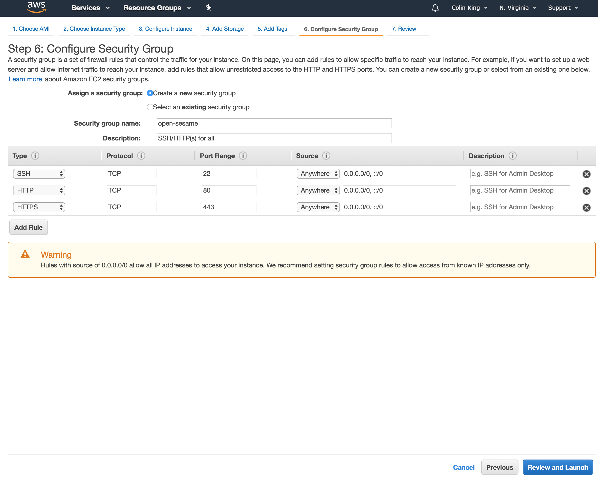
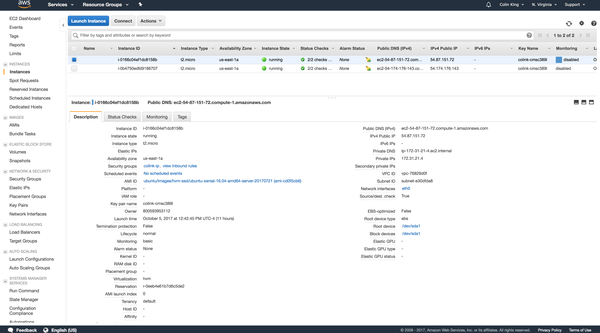

# Codelab 3: EC2

### Setup

Use the Vagrant box from codelab 2:

```
~$ vagrant up
~$ vagrant ssh
```

We'll be working heavily from the AWS GUI here, so go ahead and log in with your account.

### Launch an EC2 instance

Launch an EC2 instance via the AWS GUI:
- AMI: Ubuntu Server 16.04 LTS 64-bit
- Instance Type: t2.micro
- Configuration Details: Use the defaults
- Storage: Add a 40GiB EBS volume
- Tags: None
- Security Group: See below
- Review: Launch
	- Key Pair: See below

For the security group, create a new security group and open SSH, HTTP and HTTPS to Anywhere. Go ahead and save this security group with a memorable name, so that you can use it again.



For the key pair, create a new key pair. Choose a memorable name. Download the key pair, and do not lose it! Otherwise, you will have no way to access your instances (you'll have to kill + re-launch them).

Place the key pair in the `code/` directory in `codelab-02/`, so that it is synced onto your Vagrant box.

### SSH to EC2

You will first need to get the IP address of your EC2 instance. Look for it in the "Public IPv4" column of the "Running Instances" table, or in the metadata list after selecting one of these instances.

Note that you can also use the DNS identifier in place of the IP address ("Public DNS (IPv4)").



```
vagrant ~$ ssh -i <path to keypair .pem file> ubuntu@<public IPv4 address>
```

f.e.

```
vagrant ~$ ssh -i code/colink-cmsc389l.pem ubuntu@1.2.3.4
```

There's a lot of useful information here, so take a look around. For example, you can check the rules defined by your security group, get public IP addresses, check which keypair you configured for this instance and you can check on the state of the instance (whether it has finished launching or not, for example).

### Webserver on EC2

Let's host a simple website on EC2. On your box, create a simple HTML file. Feel free to put whatever you would like into the file.

```
ec2 ~$ vim index.html
```

```
<html>
	<body>
		<h1>Hello CMSC389L!</h1>
	</body>
</html>
```

Now, start a web server hosted on port 80. This is the default HTTP port, which we opened up in our security group. Python comes with a module which handles all of the networking and web handling necessary to run a simple web server, which we are calling with the `-m` (module) flag.

```

ec2 ~$ sudo python3 -m http.server 80
```

Now, in your browser, go to the public IP or DNS identifier of your EC2 instance, at port 80. If everything went well, you should see your basic website!

You could now go back and edit the security group you created to limit HTTP access to just a specific IP address and you will see that you are no longer able to access this web page.

### EBS Volumes

To see the attached volumes, use the list block devices command:

```
ec2 ~$ lsblk
NAME    MAJ:MIN RM SIZE RO TYPE MOUNTPOINT
xvda    202:0    0   8G  0 disk
└─xvda1 202:1    0   8G  0 part /
xvdb    202:16   0  40G  0 disk
```

As we can see, there are two attached devices (xvda1, xvdb), and one is mounted onto the root directory.

We can mount the root volume again, to look at its contents:

```
ec2 ~$ mkdir ec2-volume
ec2 ~$ sudo chown ubuntu ec2-volume
ec2 ~$ sudo mount /dev/xvda1 ~/ec2-volume
ec2 ~$ ls ec2-volume
bin   dev  home        lib    lost+found  mnt  proc  run   snap  sys  usr  vmlinuz
boot  etc  initrd.img  lib64  media       opt  root  sbin  srv   tmp  var
```

As you can see, this folder now contains the same contents as the root directory, since this volume is now mounted onto both directories.

Go ahead and unmount this volume from that folder:

```
ec2 ~$ sudo umount ~/ec2-volume
```

Let's inspect the contents of that EBS volume (change the device name based on the output of `lsblk`):

```
ec2 ~$ sudo file -s /dev/xvdb
/dev/xvdb: data
```

The output indicates that the volume has not been initialized with a file system, yet.

Let's compare that with the root device:

```
ec2 ~$ sudo file -s /dev/xvda1
/dev/xvda1: Linux rev 1.0 ext4 filesystem data, UUID=3e13556e-d28d-407b-bcc6-97160eafebe1, volume name "cloudimg-rootfs" (needs journal recovery) (extents) (large files) (huge files)
```

This indicates that xvda1 contains an ext4 file system. We want to create something similar on the EBS volume we mounted (xvdb).

```
ec2 ~$ sudo mkfs -t ext4 /dev/xvdb
mke2fs 1.42.13 (17-May-2015)
Creating filesystem with 10485760 4k blocks and 2621440 inodes
Filesystem UUID: dceca987-ea34-43f1-839f-abbb54b7ed8b
Superblock backups stored on blocks:
	32768, 98304, 163840, 229376, 294912, 819200, 884736, 1605632, 2654208,
	4096000, 7962624

Allocating group tables: done
Writing inode tables: done
Creating journal (32768 blocks): done
Writing superblocks and filesystem accounting information: done
ec2 ~$ sudo file -s /dev/xvdb
/dev/xvdb: Linux rev 1.0 ext4 filesystem data, UUID=dceca987-ea34-43f1-839f-abbb54b7ed8b (extents) (large files) (huge files)
```

Now, if we mount this volume we will be able to read and write into it:

```
ec2 ~$ sudo mount /dev/xvdb 
ec2 ~$ ls ec2-volume/
lost+found
ec2 ~$ echo "Hello World! From CMSC389L" > ec2-volume/hello.txt
ec2 ~$ ls ec2-volume/
hello.txt  lost+found
ec2 ~$ more ec2-volume/hello.txt
Hello World! From CMSC389L
```

Let's move this volume onto a new instance. Go ahead and unmount it before exiting:

```
ec2 ~$ sudo umount ~/ec2-volume
ec2 ~$ exit
```

Launch a new instance, with the same settings as above, except without the EBS volume.

In the Management Console, under "Volumes", detach the EBS volume ("Actions" > "Detach Volume") from the first instance. Then attach it to the second instance ("Actions" > "Attach Volume").

SSH onto the box and run `lsblk`. You should see the newly attached volume. Mount the volume, and you will see `hello.txt`!

You could also terminate this instance, and all data in this volume will live on.

Keep at least one instance around.

### IAM Roles

Just like we created an IAM user that we could sign in with to access our AWS account via the CLI, we can create IAM roles to give to EC2 instances.

These IAM roles/users can be given policy documents which specify exactly what permissions they have.

We will create an IAM role for accessing S3 documents, and then assign this role to a new EC2 instance.

First, SSH onto one of your previous EC2 instances. Attempt to look at the list of buckets in S3:

```
ec2 ~$ sudo apt install -y awscli
ec2 ~$ aws s3 ls
Unable to locate credentials. You can configure credentials by running "aws configure".
```

By default, your EC2 instance does not have access to any other AWS resources. We could run `aws configure` and give it the credentials we created for the CLI, however this is a bad practice. If an EC2 instance were to be compromised, an attacker would have access to admin-level credentials and could export them and use them elsewhere. Plus, if we found out, we would have to change the AWS configuration on every single EC2 instance we had running (if we are running a consumer internet company on AWS, that could be in the 100s+!). Instead, AWS roles are managed by AWS and no key is exposed in plaintext on our instance.

Go ahead and create the IAM role via the Management Console. Open the IAM service and go to the "Roles" tab. Select the correct IAM role type: "Create Role" > "AWS Service" > "EC2". On the permissions tab, search for the "AmazonS3ReadOnlyAccess" policy. Go ahead and give it a name and save the new role.

This policy documents looks like this:
```
{
    "Version": "2012-10-17",
    "Statement": [
        {
            "Effect": "Allow",
            "Action": [
                "s3:Get*",
                "s3:List*"
            ],
            "Resource": "*"
        }
    ]
}
```

As you can see, it enables the S3 Get and List operations on any AWS resource.

Go and create a new EC2 instance, with the same settings as before (minus the EBS volume), except on the "Configure Instance Details" page, select your s3-read-only policy in the "IAM role" dropdown.

SSH onto this new instance.

```
ec2 ~$ sudo apt install -y awscli
ec2 ~$ aws s3 ls
2017-09-08 12:30:19 cmsc389l
2017-09-12 13:27:27 cmsc389l-colink
2017-09-13 11:53:39 cmsc389l-colink-codelab-02-trail
2017-09-13 16:13:03 cmsc389l-colink-website
...
```

As you can see, your EC2 instance can now access your S3 data, without any form of credentials on the EC2 instance:

```
ec2 ~$ aws configure
AWS Access Key ID [None]:
AWS Secret Access Key [None]:
Default region name [None]:
Default output format [None]:
ec2 ~$ ls ~/.aws
ls: cannot access '/home/ubuntu/.aws': No such file or directory
ec2 ~$ echo $AWS_ACCESS_KEY_ID

ec2 ~$  echo $AWS_ACCESS_SECRET_KEY

```

We can go ahead and use this to sync in everything from the S3 website bucket onto our instance:

```
ec2 ~$ mkdir website
ec2 ~$ aws s3 sync s3://cmsc389l-colink-website website
...
ec2 ~$ ls website
apply.html  assets  catalog.html  CNAME  contact.html  css  faq.html  fwe  index.html  js
```

If you run a Python server in the `website/` directory, and visit the IP address via your browser (`http://<ip address>/website/`), you'll see the STICs website again!

### Wrapping Up

Make sure to terminate your EC2 instances when you are no longer using them, or else they will eat into your free credit ("Actions" > "Instance State" > "Terminate").

### Submission

There is no submission for this codelab. However, you'll be expected to understand the concepts covered in this codelab (not the commands -- just the concepts).
