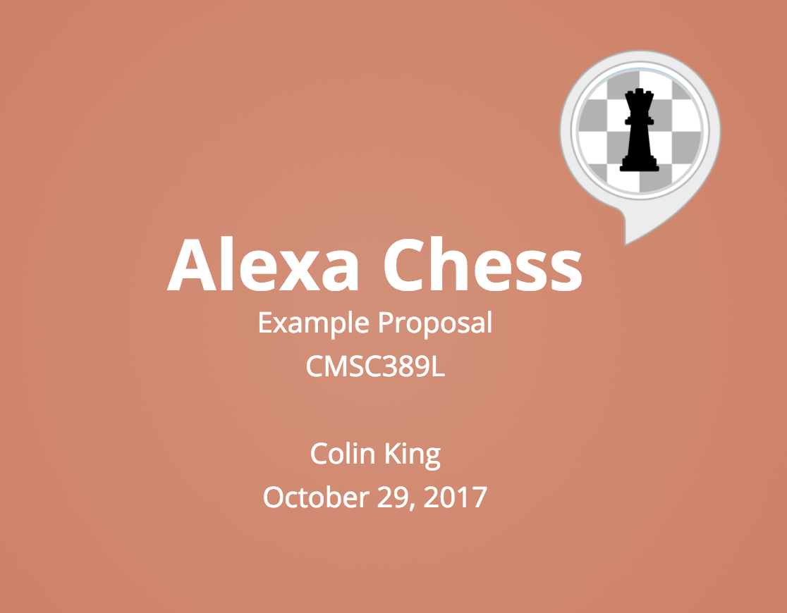
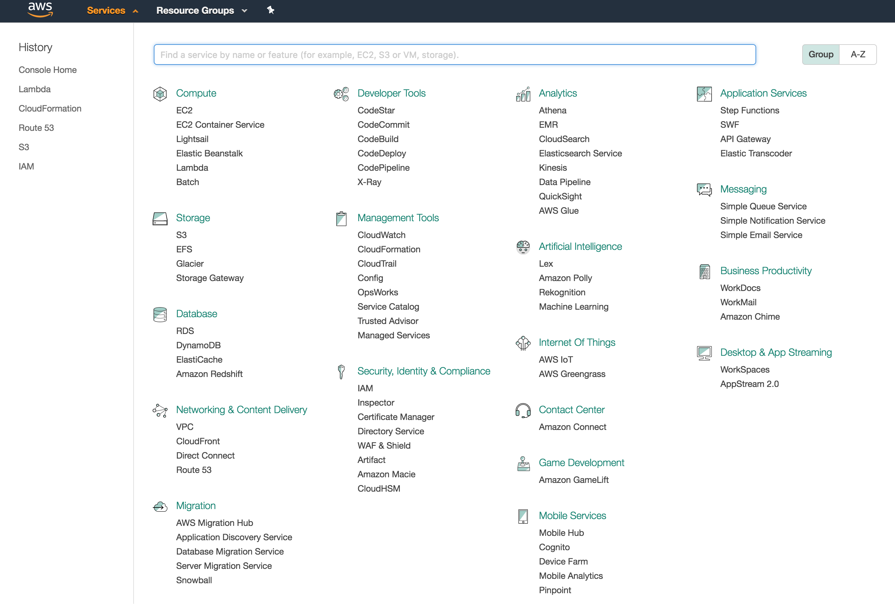

# Final Project

### Changelog

###### October 29th, 2017

- Released the initial version of this spec 🎉.

### Overview

The goal of the final project is for all of you to build some kind of meaningful project that proves your AWS skillset to employers.

It should also help you develop experience planning the architecture of a cloud system, and interconnecting different AWS services to build a project in a scalable fashion.

### Requirements

This project is meant to be extremely open-ended. There are really just two requirements:

1. You must use **at least three** AWS services.
2. **At least one** of those services must have not been covered in class.

Some AWS services are not going to be eligible to be counted towards the above requirement. These services are either required for almost any project, or are not going to be substantive in their implementation. For now, this list includes:
- IAM
- CloudWatch

Keep in mind that I reserve the right to update this list between now and the proposal demos. I'll announce any changes to this list on Piazza.

The list of services that will be considered "covered" in class are:
- S3
- EC2
- CloudFront
- SQS
- ALBs
- Lambda
- API Gateway
- DynamoDB
- ECS
- Elasticsearch Service
- CloudFormation (and Terraform)

### Deliverables

Here are the major deadlines that you should keep in mind:

| Deliverable    | Due Date    | Percent             |
| -------------- | ----------- | ------------------- |
| Proposal       | 11/5        | 10%                 |
| Checkpoint     | 11/26       | 5%                  |
| Codebase       | 12/15       | 45% (15% / service) | 
| Video Demo     | 12/16       | 10%                 |
| In-person Demo | by 12/19    | 10%                 |

The remaining 20% will be awarded based on the creativity of the project.

You can get an extra 2% per service that you use, up to 10% extra credit. You can also get up to an extra 5% for load testing your app (f.e. with [Bees with Machine Guns](https://github.com/newsapps/beeswithmachineguns)) and including this in your video demo.

All deliverables are due by 11:59:59PM on the above due date.

#### Proposal

Your proposal will be structured as a slide deck. It should touch on at least the following topics:
- What do you want to build?
- How will it work from a user's perspective?
- What services will you use to build it and how will those services work together?
- How will your service scale?
- If you need hardware, what do you need and how will you get it?
- If you need a data set, where will you get it?

See [this slide deck](http://slides.com/colinking/example-proposal) for an example of what a proposal may look like.

Submit a PDF version of your proposal slides (or website link, if hosted online) as a follow-up discussion post to [this Piazza post](https://piazza.com/class/j6r4ozi6uu75px?cid=41).

To create an architecture diagram, I would recommend either [Draw.io](https://www.draw.io/?splash=0&libs=aws2) or [Cloudcraft](https://cloudcraft.co/app).

There is a [sign-up sheet here](https://doodle.com/poll/p8ztcvqdy3ut8etx) to sign up for a time slot to present your proposal to Andrej and me. You'll have up to 5 minutes to run through your presentation, then the remaining 10 minutes will be for questions and feedback. Presentations will happen in the Sandbox makerspace (CSIC 3107).

#### Checkpoint

At roughly the halfway point, you will need to submit a write-up of your progress so far. Be sure to include:
- An overview of the progress you have made so far.
- The remaining work to be completed.
- Any changes you have made to your project since you submitted the proposal slides, including any feedback received that you will incorporate.
- Problems you have encountered and how you have addressed them.

To give you some context on the amount of detail I expect, it should be at least a half-page (single-spaced). However, include as much detail as you need!

#### Codebase

This project is meant to be released publicly so that employers can look over what you have built. Therefore, you will need to upload all work to a public GitHub repository. There will be a Piazza post in December where you can submit the link to your GitHub repo.

You will also need to include a README file which includes an overview of the project, links to your other deliverables (including the video demo!), and [the "cmsc389l" tag](https://github.com/topics/cmsc389l).

#### Video Demo

You will need to record a 2-3 minute video demo of your application.

Make sure your demo:
- Includes a high-level overview of your project
- Shows your application in action
- Walks through your application architecture
- Briefly discusses how you handled scalability concerns
- A description of the hardest problem you encountered and your solution.

To record parts of your demo, you can use the free Google Chrome extension, [Loom](https://www.useloom.com?ref=160191). There are a number of simple video editing tools out there, such as iMovie, that you can use to splice together clips to form your demo. (Have a recommendation for editing software? Post it on Piazza!)

I encourage you to make this video as professional as reasonably possible! After all, employers will see this.

#### In-person Demo

You will need to give an in-person demo of your project to Andrej and me. We will post a sign-up sheet in December to sign up for a demo slot.

We'll try to ask the kind of questions that we would expect employers to ask, if you were to show them your project!

*Note*: Most demos will be given over that weekend or that Monday (12/16-12/18), since I (Colin) will be off-campus on Tuesday, 12/19. You are also welcome to give you demo earlier, if that works better.

### Example Project: Alexa Chess App

See the example proposal here: http://slides.com/colinking/example-proposal 

#### Other Project Ideas

There are a lot of really interesting services that you can use to build fun projects! Here are some more high-level ideas:

- [AWS IoT](https://aws.amazon.com/iot/): Build something cool with sensor data! Check out the [Programmable IoT Dash Buttons](https://aws.amazon.com/iotbutton/). Or walk in to the Sandbox and chat with any of the managers about the hardware available to you.
- [AWS Lex](https://aws.amazon.com/lex/): Build a chat-based assistant on Slack/Messenger/etc. (Brownie points if you make a sassy one, like [Poncho](https://poncho.is/): [article](https://chatbotsmagazine.com/think-differently-when-building-bots-5093ddba5a56))
- Big Data: Process Twitter data in real-time with the [Kinesis Streams](https://blog.insightdatascience.com/getting-started-with-aws-serverless-architecture-tutorial-on-kinesis-and-dynamodb-using-twitter-38a1352ca16d), or build an AWS MapReduce job to create a data visualization off of a [Wikipedia data dump](https://dumps.wikimedia.org/)
- [AWS GameLift](https://console.aws.amazon.com/gamelift/home?region=us-east-1#/): Build a multiplayer game and host it in the cloud!

That only scratches the surface of the number of ideas you could run with. Here a picture of all of the services currently available on AWS!

### Hardware

I have an Amazon Alexa that I'm happy to lend to a team to use. It'll be available on a first-come, first-serve basis, so shoot me an email if you'd like to use it.

The [Sandbox](sandbox.cs.umd.edu) (new CS makerspace) has a lot of hardware that can be used for projects, along with guidance and advice! If you haven't worked with hardware before, this is a great opportunity to get started and try it out. If you haven't been to Sandbox before, it is located in CSIC 3107, just on your right before you walk across the bridge to AVW.

If you are looking for any kind of hardware, or if you have hardware that you think others might be interested in using, make a post on Piazza!

### Competitions

There are a handful of opportunities to submit your project into competitions and compete for prizes! Here are a few:

- [Alexa Skills Challenge Offers $250,000 in prizes for Best Kid Skills](https://developer.amazon.com/blogs/alexa/post/f9671946-9039-45a4-83a7-ed1e15de682d/alexa-skills-challenge-offers-250-000-in-prizes-for-best-kid-skills)
- [Amazon IoT Challenge](https://awsiot.devpost.com/) (Nov 16th deadline!)
- [Online hackathons](https://devpost.com/hackathons?utf8=%E2%9C%93&search=&challenge_type=online&sort_by=Submission+Deadline)
- [Or in-person hackathons over the weekends!](https://www.facebook.com/groups/hackersofmaryland/) (Check Terrapin Hackers. If we have a bus then you don't need to be admitted, just hop on!)

### Questions

> Are we limited to any language or can we use any language of our choice?

You are welcome to use whichever language of your choice. Though keep in mind that Python would be the preferred choice, since both TAs are experienced with the language and the AWS libraries, so we'll be able to help out more.

If you choose another language, make sure to address this in your proposal.

> Can we work in teams or do we need to work on our own?

I heavily encourage you to work as a single-person team, since building a full project on your own is much more meaningful to employers then team projects where your contributions are harder to pinpoint.

However, if there is a situation where two students really want to work together, then you can go for it. I will expect the scope of the project to be double in size to account for two teammates working together. **If you want to work on a team project, shoot me an email soon** with an overview of what you want to build, so that I can get back to you ASAP on whether it is the right scope for a two-person team.
